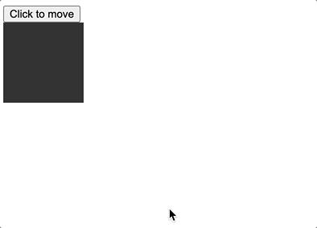

# Event Loop를 알면 알 수 있다!

## 버튼눌러서 박스 배치하기

```html
<!DOCTYPE html>
<html lang="kr">
  <head>
    <meta charset="UTF-8" />
    <meta http-equiv="X-UA-Compatible" content="IE=edge" />
    <meta name="viewport" content="width=device-width, initial-scale=1.0" />
    <title>Document</title>
  </head>
  <body>
    <button>Click to add</button>
    <script>
      const button = document.querySelector("button");
      button.addEventListener("click", () => {
        const element = document.createElement("h1");
        document.body.appendChild(element);
        element.style.color = "red";
        element.innerHTML = "Hello";
      });
    </script>
  </body>
</html>
```

### 이코드의 결과


### Q.왜 이런결과가나왔을까?

코드에서는 h1 엘리먼트를 생성하고 body에 바로 추가해버리고난 후 style을 지정하고, innerHTML을 지정해주었습니다
그런데 왜 결과는 이모든것들이 적용된 h1이 나오게 됬을까요?

### A

우선 addEventListener은 Task Queue에 callback 함수를 담습니다
담기는함수는

```js
() => {
  const element = document.createElement("h1");
  document.body.appendChild(element);
  element.style.color = "red";
  element.innerHTML = "Hello";
};
```

이함 수 자체입니다
click 이벤트가 발생하면 이함수를 call stack에 쌓아 실행하게되는데, 이 함수 내 모든 코드가 실행이되어야
비로소 event loop가 call stack을 벗어나, Render하게 됩니다.

> 그렇기 때문에 결국 화면상에 Render Tree를 만들기 전에 일어나는 일들이기 때문에 순서는 상관이 없는 것입니다

## 순서대로 transform 적용시키기

```html
<!DOCTYPE html>
<html lang="kr">
  <head>
    <meta charset="UTF-8" />
    <meta http-equiv="X-UA-Compatible" content="IE=edge" />
    <meta name="viewport" content="width=device-width, initial-scale=1.0" />
    <title>Document</title>
    <style>
      .box {
        width: 100px;
        height: 100px;
        background-color: #333;
      }
    </style>
  </head>
  <body>
    <button>Click to move</button>
    <div class="box"></div>
    <script>
      const box = document.querySelector(".box");
      const button = document.querySelector("button");
      button.addEventListener("click", () => {
        box.style.transition = "all 300ms";
        box.style.transform = "translateX(400px)";
        box.style.transform = "translateX(-400px)";
      });
    </script>
  </body>
</html>
```

### 이코드의 결과는?



### Q.왜 이런 결과가 나왔을까?

위 경우와 마찬가지로 콜백함수 내 모든 코드들이 적용되고 나서야 Render Tree를 구성하기 때문에 마지막 값인, -400만 남았기 때문입니다

### A.순서대로 동작시켜보기

보통 css에서 animation으로 처리하지만 이렇게 하기위해서는 setTimeout을 사용하면됩니다
setTimeout은 Task Queue로 함수를 보내버리고 call stack이 지워지고 event loop가 순회할 수 있게끔 해줍니다

### 이런식으로 setTimeout을 활용하면 원하는데로 동작시킬 수 있다

```html
<!DOCTYPE html>
<html lang="kr">
  <head>
    <meta charset="UTF-8" />
    <meta http-equiv="X-UA-Compatible" content="IE=edge" />
    <meta name="viewport" content="width=device-width, initial-scale=1.0" />
    <title>Document</title>
    <style>
      .box {
        width: 100px;
        height: 100px;
        background-color: #333;
      }
    </style>
  </head>
  <body>
    <button>Click to move</button>
    <div class="box"></div>
    <script>
      const box = document.querySelector(".box");
      const button = document.querySelector("button");
      button.addEventListener("click", () => {
        box.style.transition = "all 300ms";
        setTimeout(() => {
          box.style.transform = "translateX(400px)";
        }, 0);
        setTimeout(() => {
          box.style.transform = "translateX(0px)";
        }, 1000);
      });
    </script>
  </body>
</html>
```


## 브라우저 죽여보기

```html
<!DOCTYPE html>
<html lang="kr">
  <head>
    <meta charset="UTF-8" />
    <meta http-equiv="X-UA-Compatible" content="IE=edge" />
    <meta name="viewport" content="width=device-width, initial-scale=1.0" />
    <title>Document</title>
    <style></style>
  </head>
  <body>
    <button>While(true)</button>
    <script>
      const button = document.querySelector("button");
      button.addEventListener("click", () => {
        let i = 0;
        while (true) {
          console.log(i);
          i++;
        }
      });
    </script>
  </body>
</html>
```

위코드에서 버튼을 누르면 log에는 숫자가 쭉 찍히면서 브라우저에 손도못대고, 강제종료되기만을 기다려야합니다

### 왜 브라우저가 죽어버릴까?

callback 함수로 while(true){} 라는 무한루프를 보내보렸기 때문에
Task Queue에서 call stack으로 넘어간뒤 event loop가 call stack에 묶여버려 화면이 더이상 업데이트되지 못하는 현상입니다

> 그래서 오래걸리는 작업(통상 서버통신)은 비동기적으로(Promise,나 async&await)처리하는 이유입니다. 오래걸리는 작업을 백그라운드에 돌려놓고 다른작업을 하기 위함이죠!

### setTimeout으로 재귀함수를 돌리면

```js
function handleClick() {
  console.log("handleClick");
  setTimeout(function () {
    console.log("setTimeout");
    handleClick();
  }, 0);
}
const button = document.querySelector("button");
button.addEventListener("click", () => {
  handleClick();
});
```

이는 브라우저는죽지 않고, 로그만 무한정 찍힙니다. setTimeout은 Task Queue에서 하나씩 call stack으로 넘기고 event loop를 한바퀴 돌기때문에 call stack이 계속 소비되며, 쌓이면서 while(true) 와같이 브라우저가 죽지 않습니다. 다른동작도 정상적으로 할수있습니다

### Promise.then을 돌리면

```js
function handleClick() {
  console.log("handleClick");
  Promise.resolve().then(() => {
    console.log("then");
    handleClick();
  });
}
const button = document.querySelector("button");
button.addEventListener("click", () => {
  handleClick();
});
```

이 경우에는 while(true) 경우와 동일하게 Microtask Queue에 무한정으로 then의 콜백함수가 쌓이면서 Render되지 않고, 멈추게됩니다
Microtask Queue는 Queue에 있는 모든 callback 함수를 call stack으로 보내고서야 Task Queue로 event loop를 이동시켜줍니다

### request animation frame 은?

이것도 queue인데 렌더링이 되기전에 무조건 실행해주는 callback을 받습니다

```js
const button = document.querySelector("button");
button.addEventListener("click", () => {
  requestAnimationFrame(() => {
    document.body.style.backgroundColor = "blue";
  });
  requestAnimationFrame(() => {
    document.body.style.backgroundColor = "red";
  });
});
```

결과로는 최종적으로 red가 됩니다. 왜냐하면 queue로 쌓이기때문에 마지막으로 실행된 코드한줄이 유효하게 됩니다

### 이런식으로 바꾸면 반짝할수 있습니다

```js
const button = document.querySelector("button");
button.addEventListener("click", () => {
  requestAnimationFrame(() => {
    document.body.style.backgroundColor = "blue";
  });
  setTimeout(() => {
    document.body.style.backgroundColor = "red";
  }, 0);
});
```
